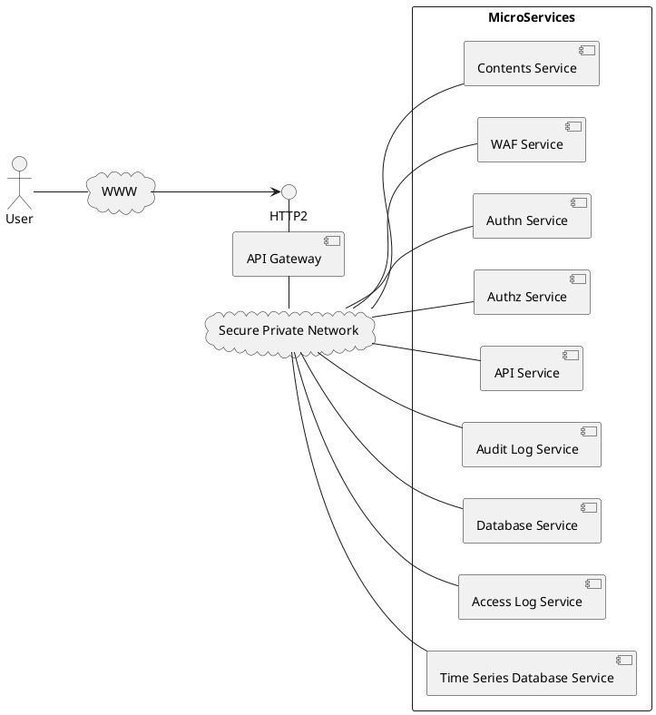

# 概念モデル

Chip-in を構成する要素は外から見ると、1個のコアサービスと複数のマイクロサービスからなります。ブラウザからのアクセスをコアサービスで受け付けマイクロサービスに分散して処理を行います。接続の方向をマイクロサービスからコアサービスへの方向に限定することで前述の課題を解決します。コアサービスはグローバルIPとサーバ証明書を持ちます。マイクロサービスはクライアント証明書をもっており、コアサービスとの間で mTLS認証を行います。
ユーザからの HTTP アクセスをコアサービスの API Gateway で受け、SPN(Secure Private Network) 経由でマイクロサービスを集約します。

## 階層構造

### クラスタ
Chip-in のクラスタ内には複数のサービスを収容することができます。クラスタはサービス間通信のためのプライベートなネットワークとインターネットとのゲートウェイを持ちます。

クラスタにコアサービスが含まれている場合は、ゲートウェイはグローバルIPを持ち、インターネットからの通信を受けつけ、HTTPS, QUIC の接続をコアサービスに DNAT します。

コアサービスが含まれていない場合は、ゲートウェイはコアサービスへの接続のみを提供します。
クラスタは IaaS 上に構築するのが一般的ですが、オンプレミス上のデバイスにアクセスする場合や開発環境などでは、単一サーバ上の docker compose であったり、 kubernaetes, docker swarm などのコンテナクラスタであったりします。

### サービスとインスタンス

コアサービスもマイクロサービスもサービスの一種です。サービスにはインスタンスの定義が登録されており、デプロイするとインスタンスが起動されます。冗長負荷分散の目的で、一つのサービスに同じインスタンスを複数起動することもできます。これをレプリカセットと呼びます。

### コンテナ

一つのインスタンスの中に複数のコンテナを収容できます。その場合、メインとなるコンテナに対して補助的な機能を提供するコンテナをサイドカーと呼びます。
一つのインスタンスの中でコンテナ間通信する場合、127.0.0.* のアドレスで通信できます。この場合、通信はインスタンス内で閉じており、物理的にも一つのホストサーバの中で通信することが保証されます。逆にサイドカーをメインとなるコンテナと別のホストサーバに分散して動作させることはできません。

### IaaS 上の用語

クラウドベンダごとの用語と Chip-in で使用する用語の対応は以下のとおりです。 

| Chip-in | AWS ECS | GCP Cloud Run | Azure Container Apps |
| :---- | :---- | :---- | :---- |
| クラスタ | ECS クラスタ | (GCPプロジェクト / リージョン) | 環境 (Environment) |
| サービス | ECS サービス | Cloud Run サービス | コンテナアプリ (Container App) |
| インスタンス |  ECS タスク | Cloud Run インスタンス | Pod / レプリカ |
| コンテナ | ECS コンテナ | コンテナ | コンテナ |

:::info
Chip-in の階層構造は docker compose, kubernaetes, docker swarm の個々の概念モデルに直接写像できません。個々の実装で同様の概念モデルを構成する必要があります。以下の課題が判明しています。
- docker compose はレプリカセットをサポートしていません。
- docker swarm はサイドカーをサポートしていません。
- kubernetes は機能的にすべてをサポートしていますが自由度が高すぎるため、IaCの書き方で Chip-in の階層構造を実装する必要があります。
:::

## レルム

Chip-in ではマルチテナント SaaS の提供を目的として、接続されるサービスをレルムと呼ばれるグループごとに論理的に分離する機能を提供します。
API Gateway, SPN Hub などの基盤となるサービスのインスタンスはレルム間で共有しますが、配置されるサービスは異なるレルムに属するサービスとは一切通信することはできません。
master レルムはシステムで予約されており、レルムの作成、変更、削除などの管理するためのサービスが提供されます。master レルムの定義はインベントリから読み取られるのではなくビルトインとして SPN Hub, API Gateway に組み込まれています。

レルムによる分離について、以下の例外があります。
- master レルム上のゾーンはテナントのレルムに貸し出され、テナントは Chip-in ベンダからゾーンを借りてサブドメインを作ることができます
- テナントレルムのルーティングチェーン、仮想ホストは master レルム上に定義される主要なルーティングチェーンをライブラリとして参照できます
- テナントレルムは master レルム上の汎用的なマイクロサービスを利用することができます。

## マイクロサービス認証局

Chip-in に参画するマイクロサービスは必ずマイクロサービス認証局の認証を得なければなりません。
運用者はこの認証局の CP/CPS を定義する必要があります。
マイクロサービス証明書の発行は SCEP プロトコルにより、行われます。
SCEP サービスはCSRの内容が事前に承認された証明書の属性に一致した場合のみマイクロサービス証明書を発行します。

## インベントリサービス

コアサービス内にはインベントリサービスが含まれています。インベントリサービスは S3 や etcd などの KVS をバックエンドに持ち、インベントリ Swagger ファイルで定義された Restful API を提供します。インベントリサービスには以下のものが登録されています。

- 登録済みマイクロサービス証明書のリスト
- マイクロサービス証明書を発行するCA局の証明書
- マイクロサービス定義のリスト
- ゾーン定義（ホスト定義、サーバ証明書を含む）

インベントリサービスはアクセス元のマイクロサービス証明書に含まれる拡張属性を使用してじ次世代アクセス制御(NBAC)を行います。NBAC は rego で記述され、opa-go などのクレートを使用して実装されます。

## SPN

SPNはAPI Gateway とマイクロサービスの間およびマイクロサービス間の通信において、高いセキュリティと配置の柔軟性を提供します。

### セキュリティ

一般的にはサービスはコンテナクラスタの中で通信を行い、コンテナ間の通信はそのクラスタの仮想ネットワークに閉じているため、平文での通信やIPアドレスでの特定で十分とされています。
しかし、以下のようなケースを考えると、サービスでも仮想ネットワークを超えて接続したい場合があります。
- 開発途上のサービスを一時的に接続してシステムテストを実施したい
- データベースサービスをコンテナクラスタとは別にリソースを確保することで処理性能やデータ容量を確保したい
- 稼働中のシステムに一時的にリソースを追加してスケールアウトしたい

### サービスディスカバリ

多くの高可用性システム、負荷分散システムはサービスの場所、死活を特定するために DNS や TCP Connect のポーリングを行なっています。
しかし、ポーリングは間隔を開けて行われるため、レイテンシを避けることができません。また、失敗した時にはその原因が不明であるため、障害検知、復旧検知を難しくてしています。
Chip-in は逆接続アーキテクチャにより、ZPSD(Zero Polling Service Discovery)を実現しています。
サービスを実装するインスタンス側から接続するため、SPN Hub はポーリングを行わずにサービスの起動を検出します。

### SPN Hub

SPN の中心となる SPN Hub はコアサービスのサイドカーコンテナとして実装されます。

### 接続方式

Chip-in では SPN Hub を中心として多数のマイクロサービス（Micro Service）をハブ状に接続する構成を取ります。
マイクロサービスが SPN Hub に接続するために以下のいずれかの方法を取る必要があります。

|方式|説明|
|--|--|
|直接接続方式| マイクロサービスの実装プログラムから直接サービスバスに接続する。接続には serviceConsumer モードと serviceProvider モードの2種類がある|
|エージェント方式| マイクロサービスを実装するコンテナでサイドカーとしてエージェント(Agent)を起動し、実装プログラムはエージェントとの間でTCP通信を行う。TCP通信にはエージェント側が listen する serviceConsumer モードとエージェントからアプリケーションに接続する serviceProvider モードがある。|

### クラスタマネージャ

Chip-in はクラスタマネージャにより、マイクロサービスインスタンスの起動・停止を行います。 SPN Hub はクラスタマネージャを経由して以下の機能を提供します。
- 日次スケジュールに従って営業時間帯のみインスタンスを常駐させる
- サービスにアクセスがあった時点でインスタンスを起動する

API Gateway はクラスタマネージャんを経由して以下の機能を提供します。
- トップページ表示時に関連するサービスが不在の場合は揃うまで待つソーリーページを返す。

## API　Gateway

API Gateway は Web アプリケーションをマイクロサービスに分割して実装するための基本的な機能を提供します。
たとえば、WebコンテンツやAPIを提供する Web サイトを構築する際に、以下のように WAFサービス、認証サービス、認可サービス、コンテンツサービス、APIサービス、データベースサービス、アクセスログサービス、監査ログサービス、時系列データベースサービスというようにマイクロサービスに分割して提供できます。API Gateway とマイクロサービスの間およびマイクロサービス間の通信は SPN を経由して行われます。
API Gateway はコアサービスのメインコンテナと動作します。

### ゾーン

API Gateway にはDNSゾーンを登録します。ゾーンにゾーン同期サービスが登録されている場合、ゾーンの内容を API Gateway と同期します。
また、ACME サービスが登録されている場合、 ACME DNS-01 プロトコルでサーバ証明書を取得します。
master ゾーンはシステムで予約されており、master レルムのサービスを提供するのに用いられます。
また、レルムのユーザがドメインを持たない場合、 master ゾーンの下のサブドメインを使用することができます。

### BFF

BFF(Backend for Frontend)機能はフロントエンドからの API アクセスに対する認証機能を提供します。
Web プロキシのコンフィグレーションでロケーション(FQDN+パスのパターンで特定)を指定してBFFを追加できます。
BFFは以下の機能を提供します。
- Open ID Connect プロトコルで IdP を呼び出し、IDトークンとアクセストークンを取得
- IDトークンとアクセストークンをセッション情報として構成情報データベースに保存
- セッションIDをセキュアなCookie（HttpOnly, Secure, SameSite=Strict）を発行
- 単純なリクエストを拒否（400を返す）
- 必要に応じて HTTPレスポンスに CORS 関係のヘッダを追加
- 必要に応じて HTTPレスポンスに CSPヘッダを追加
- 必要に応じて HTTPレスポンスに X-Frame-Options ヘッダを追加
- 必要に応じてセッション情報の内容を取得するAPIを提供
- 必要に応じて指定されたパスパターンに一致するGETリクエストに対して IdP へのリダイレクトを返す
- 必要に応じてセッション情報の一覧取得（自分の接続中のセッションの確認）・削除（管理者による強制ログアウト）を別のBFFを経由して行える API を提供

:::info
CSRF防御について CSRFトークンを発行するという機能を追加することも可能であるが、セキュアなCookieの発行と単純なリクエストの拒否で十分であると考えています。
:::

#### 2フェーズセッション管理

ユーザの認証前と認証後の両方で串刺ししてセッションを管理できるようにします。

##### 認証前セッション

CHIPIN_SESSION Cookie でセッションを識別しますが、攻撃などで負荷がかからないようにサーバ側での管理は行わず JWT の発行にとどめます。認証前セッションのセッションIDをログに記録することによって、以下のような場合でもアクセスを串刺しにできます。

- ブラウザを開いたままログアウトして別のユーザでログインしなおした場合
- SP にアクセスして認証サーバにリダイレクトされた場合

また、ドメイン内でセッションを共有できます。

#### 認証済みセッション

認証に成功すると、認証前セッションで発行されたセッションIDをキーにしてセッションオブジェクトをメモリ上に作成し、そこにユーザIDなど認証で得られたユーザの属性情報を保持します。

### M2M通信

外部システムが HTTP の API でアクセスしてくる場合のセッション管理について、 Set-Cookie が効かないおそれがあります。このようなマシン対マシン（M2M）通信では、 OAuth 2.0 クライアントクレデンシャルズグラント (Client Credentials Grant) という認証フローが使用されます。M2M 通信と BFF とはパスなどによって排他的に適用されます。
これは、ユーザーの介在なしに、アプリケーション自体が認証を行い、APIアクセスのためのトークンを取得するための仕組みです。以下に認証フローのステップを示します。

#### 1. 事前登録
APIを利用したい外部システム（クライアント）は、事前にあなたの認証サーバー（IdP）に登録されます。登録後、そのシステム専用の Client ID と Client Secret が発行されます。これらはシステムのIDとパスワードのようなものです。

#### 2. トークンの要求
外部システムは、自身の Client ID と Client Secret を使って、認証サーバーのトークンエンドポイントに直接APIリクエストを送信し、アクセストークンを要求します。

#### 3. トークンの取得
認証サーバーは送られてきた Client ID と Client Secret を検証し、正当であれば、そのシステム（クライアント）の権限を表すアクセストークンを発行します。このトークンは特定のユーザーに紐づくものではなく、システム自体に紐づきます。

#### 4. APIの呼び出し
外部システムは、取得したアクセストークンを Authorization: Bearer アクセストークン ヘッダーに含めて、保護されたAPIを直接呼び出します。

#### 5. APIでの検証
API Gateway は、リクエストで受け取ったアクセストークンを検証し、有効であればリクエストを処理します。

### リクエストコンテキスト

（未）

### ルーティング機能

（未）

### 冗長負荷分散機能

以下の冗長負荷分散をサポートします。（詳細未設計）

- Stateless Distributable
- Sticky Session Distributable
- Warm Standby(Activeプロセスのダウンを検知後すぐに切り替え)
- Cold Standby(Activeプロセスのダウンを検知後タスク起動)

### エラーレスポンス調整機能

API Gateway がブラウザにエラーを返す場合、そのボディ部の内容については以下のような課題がある。
- トップページのアクセスにおいて API Gateway の内部で発生する 400番台、500番台のエラーについてアプリケーションの Web UI のデザインにあわせた HTML を表示したい
- トップページ以外のアクセスにおいて HTML を返してもエンドユーザに表示されるわけではないので無意味である
- API のアクセスにおいて、 API Gateway の内部で 400番台、500番台のエラが発生した場合、 Accept ヘッダーにない Content-Type などAPIの呼び出し側が想定していないものを返すのはアプリケーションのエラー処理を複雑にする（間のリバースプロキシが入っている場合のエラー処理を追加しなければならない）
これらの問題に対応するために

### ロボット拒否

ビルトインチェーンでは検索エンジンのロボットを拒否する機能を提供する。

### コンテントセキュリティポリシー管理

CSPヘッダーを付与する

#### CSP違反記録サービス

#### iframe 管理

X-Frame-Options ヘッダーを付与する

### 監査ログ記録サービス

[pino HTTP送信モジュール](https://github.com/procube-open/pino-transmit-http)を推奨。

### WAFサービス

[ModSerurity](https://modsecurity.org/)にSPNエージェントをサイドカーとして付与して提供します。
