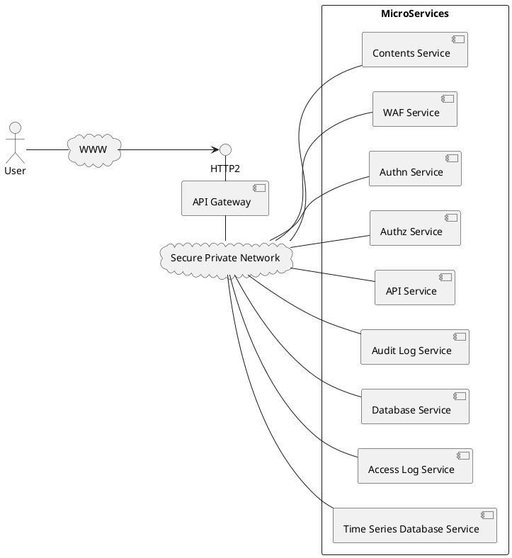

# 概念モデル

Chip-in を構成する要素は外から見ると、1個のコアノードと複数のリソースノードからなります。ブラウザからのアクセスをコアノードで受け付けリソースノードに分散して処理を行います。接続の方向をリソースノードからコアノードへの方向に限定することで前述の課題を解決します。
ユーザからの HTTP アクセスをコアノードの API Gateway で受け、SPN(Secure Private Network) 経由でマイクロサービスを集約します。

## API　Gateway

API Gateway は Web アプリケーションをマイクロサービスに分割して実装するための基本的な機能を提供します。
たとえば、WebコンテンツやAPIを提供する Web サイトを構築する際に、以下のように WAFサービス、認証サービス、認可サービス、コンテンツサービス、APIサービス、データベースサービス、アクセスログサービス、監査ログサービス、時系列データベースサービスというようにマイクロサービスに分割して提供できます。API Gateway とマイクロサービスの間およびマイクロサービス間の通信は SPN を経由して行われます。

## SPN

SPNはAPI Gateway とマイクロサービスの間およびマイクロサービス間の通信において、高いセキュリティと配置の柔軟性を提供します。

### セキュリティ

一般的にはマイクロサービスはコンテナクラスタの中で通信を行い、コンテナ間の通信はそのクラスタの仮想ネットワークに閉じているため、平文での通信やIPアドレスでの特定で十分とされています。
しかし、以下のようなケースを考えると、マイクロサービスでも仮想ネットワークを超えて接続したい場合があります。
- 開発途上のサービスを一時的に接続してシステムテストを実施したい
- データベースサービスをコンテナクラスタとは別にリソースを確保することで処理性能やデータ容量を確保したい
- 稼働中のシステムに一時的にリソースを追加してスケールアウトしたい

### サービスディスカバリ

多くの高可用性システム、負荷分散システムはサービスの場所、死活を特定するために DNS や TCP Connect のポーリングを行なっています。
しかし、ポーリングは間隔を開けて行われるため、レイテンシを避けることができません。また、失敗した時にはその原因が不明であるため、障害検知、復旧検知を難しくてしています。
Chip-in は逆接続アーキテクチャにより、ZPSD(Zero Polling Service Discovery)を実現しています。
サービスを実装するインスタンス側から接続するため、SPN Hub はポーリングを行わずにサービスの起動を検出します。

### リクエストコンテキスト

### ルーティング機能

Stateless Distributable
Sticky Session Distributable
Warm Standby(Activeプロセスのダウンを検知後すぐに切り替え)
Cold Standby(Activeプロセスのダウンを検知後タスク起動)

### エラーレスポンス調整機能

API Gateway がブラウザにエラーを返す場合、そのボディ部の内容については以下のような課題がある。
- トップページのアクセスにおいて API Gateway の内部で発生する 400番台、500番台のエラーについてアプリケーションの Web UI のデザインにあわせた HTML を表示したい
- トップページ以外のアクセスにおいて HTML を返してもエンドユーザに表示されるわけではないので無意味である
- API のアクセスにおいて、 API Gateway の内部で 400番台、500番台のエラが発生した場合、 Accept ヘッダーにない Content-Type などAPIの呼び出し側が想定していないものを返すのはアプリケーションのエラー処理を複雑にする（間のリバースプロキシが入っている場合のエラー処理を追加しなければならない）
これらの問題に対応するために

### 監査ログ記録サービス

[pino HTTP送信モジュール](https://github.com/procube-open/pino-transmit-http)を推奨。CSPヘッダ対応も同時に行う。

### 認証サービス

BFF(Backend for Frontend)機能はフロントエンドからの API アクセスに対する認証機能を提供します。
Web プロキシのコンフィグレーションでロケーション(FQDN+パスのパターンで特定)を指定してBFFを追加できます。
BFFは以下の機能を提供します。
- Open ID Connect プロトコルで IdP を呼び出し、IDトークンとアクセストークンを取得
- IDトークンとアクセストークンをセッション情報として構成情報データベースに保存
- セッションIDをセキュアなCookie（HttpOnly, Secure, SameSite=Strict）を発行
- 単純なリクエストを拒否（400を返す）
- 必要に応じて HTTPレスポンスに CORS 関係のヘッダを追加
- 必要に応じてセッション情報の内容を取得するAPIを提供
- 必要に応じて指定されたパスパターンに一致するGETリクエストに対して IdP へのリダイレクトを返す
- 必要に応じてセッション情報の一覧取得・削除を別のBFFを経由して行える API を提供

:::info
CSRF防御について CSRFトークンを発行するという機能を追加することも可能であるが、セキュアなCookieの発行と単純なリクエストの拒否で十分であると考えています。
:::

## 接続方式

Chip-in ではAPI Gateway を中心として多数のマイクロサービス（Micro Service）をハブ状に接続する構成を取ります。
マイクロサービスがサービスバスに接続するために以下のいずれかの方法を取る必要があります。

|方式|説明|
|--|--|
|直接接続方式| マイクロサービスの実装プログラムから直接サービスバスに接続する。接続にはクライアントモードとサーバモードの2種類がある|
|エージェント方式| マイクロサービスを実装するコンテナでサイドカーとしてエージェント(Agent)を起動し、実装プログラムはエージェントとの間でTCP通信を行う。TCP通信にはエージェント側が listen するクライアントモードとエージェントからアプリケーションに接続するサーバモードがある。|

### タスクマネージャ

chip-in はタスクマネージャにより、コアノードコンテナ、リソースノードコンテナの起動・停止を行います。クラスタマネージャは以下の機能を持ちます。
- 日次スケジュールに従って営業時間帯のみコンテナを常駐させる（Faasに実装）
- サービスにアクセスがあった時点でコンテナを起動（fc_serverに実装）
トップページ表示時に関連するマイクロサービスが不在の場合は揃うまで待つソーリーページを返す。

### WAFサービス

[ModSerurity](https://modsecurity.org/)にSPNエージェントをサイドカーとして付与して提供します。